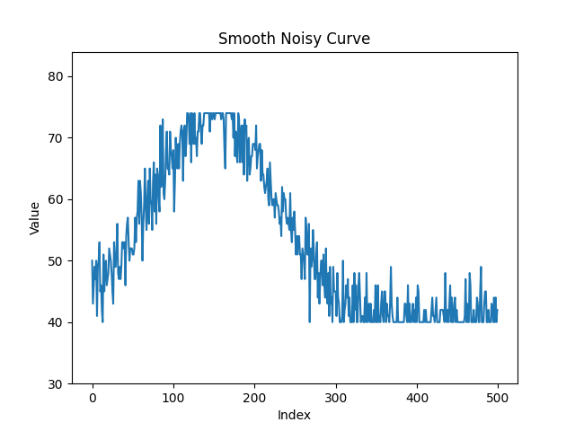

# FastQ Mock Generator
<a href="https://zenodo.org/doi/10.5281/zenodo.10899656"></a>
  
This script generates a FastQ file with mock sequences assembled from a template sequence and an upstream sequence. It will need a FASTA file with the target sequence. It can be used with the parameters set up as commands or by pointing to a parameters.json file as shown in the example scripts. It will output a FastQ-like file with Phred scores attached.

The chosen template sequence comes from an RSV fusion inhibitor peptide derived from a 20-amino acid segment from HR2 (positions 497-516) [^1]. The function that generates the Phred scores will create a smoothed noisy curve based on a center of maximal Phred score using the ASCII 33-126 offset.[^2]. 
  


*Figure 1: Smooth noisy Phred scores of a sample sequence with 500 bases. The value on the Y-axis represents the Phred score, and the X-axis denotes the position of the sequence (Index). Phred scores outside of the thresholds were clipped and substituted with their limit values.*
  
## Usage
  
Install requirements.txt using python>3.0. You can run the script using the following command:
  
```bash
python fastq_generator.py [OPTIONS]
```
  
## Options
  
- `--output_file`: The output file. Default is `output.fastq`.
- `--template_sequence`: The template sequence in fasta format. If not provided, a default sequence is used.
- `--with_parameters`: Flag to indicate if parameters should be used. If not passed, default parameters are used.
- `--upstream_sequence`: The upstream sequence. Default is "GCCGGCCATGGCG".
- `--left_margin`: The left margin. Default is 15.
- `--total_length`: The total length. Default is 500.
- `--number_of_sequences`: The number of sequences. Default is 10.
- `--center`: The center. Default is 150.
- `--min_val`: The minimum value. Default is 40.
- `--max_val`: The maximum value. Default is 73.
- `--std_dev`: The standard deviation. Default is 75.
- `--noise_level`: The noise level. Default is 0.1.
  
## Example
See the other example in the examples folder. Permissions are needed to run the scripts (chmod u+x).
```bash

python fastq_generator.py --output_file output.fastq --template_sequence template.fasta --with_parameters --upstream_sequence GCCGGCCATGGCG --left_margin 15 --total_length 500 --number_of_sequences 10 --center 150 --min_val 40 --max_val 73 --std_dev 75 --noise_level 0.1

```
  
## References
[^1]: Gaillard V, Galloux M, Garcin D, Eléouët JF, Le Goffic R, Larcher T, Rameix-Welti MA, Boukadiri A, Héritier J, Segura JM, Baechler E. A short double-stapled peptide inhibits respiratory syncytial virus entry and spreading. Antimicrobial agents and chemotherapy. 2017 Apr;61(4):10-128. DOI: [10.1128/AAC.02241-16](https://doi.org/10.1128/AAC.02241-16)
[^2]: Cock PJ, Fields CJ, Goto N, Heuer ML, Rice PM. The Sanger FASTQ file format for sequences with quality scores, and the Solexa/Illumina FASTQ variants. Nucleic acids research. 2010 Apr 1;38(6):1767-71. DOI: [10.1093/nar/gkp1137](https://doi.org/10.1093/nar/gkp1137)