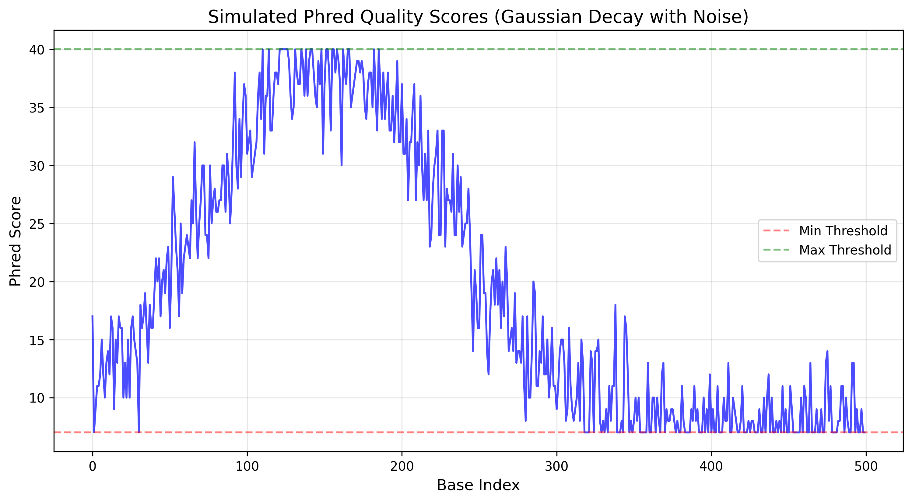

# mock-fastq-generator

<a href="https://zenodo.org/doi/10.5281/zenodo.10899656"></a>


`mock-fastq-generator` is a lightweight Python utility for the generation of mock FASTQ datasets for targeted constructs. It utilizes a parametric Gaussian model to simulate controlled read quality degradation and introduces substitution noise, allowing to generate synthetic sequencing data for testing bioinformatics pipelines without heavy external dependencies and without disclosure of sensitive data.

The v2.0 update introduces full standard Python packaging, paired-end read simulation, gzip compression, pipeline streaming (stdout), rigorous automated testing, and full PEP 8 compliance.

## Features

- **Parametric Quality Modeling**: Generates realistic Phred score decay curves using a tunable Gaussian distribution.
- **Targeted Assembly**: Concatenates user-defined upstream sequences (e.g. adapters or restriction sites) with template sequences.
- **Paired-End Support (`--paired-end`)**: Automatically generates R1 (forward) and R2 (reverse complement) paired-end sequence files.
- **Compression (`--gzip`)**: Natively writes compressed `.fastq.gz` files to save disk space.
- **Pipeline Streaming (`--stdout`)**: Output generated sequences directly to standard output for seamless integration with tools like FastQC or BWA without intermediate files.
- **Reproducible Configurations**: Load complex parameter configurations directly from JSON files.



*Figure 1: Simulated Phred quality scores (Gaussian Decay with Noise) across a 500-base sequence. Generated programmatically using the `mock-fastq-generator` core API.*

## Installation

`mock-fastq-generator` requires **Python 3.8+**. It is fully pip-installable. Clone the repository and install it directly:

```bash
git clone https://github.com/florez-alberto/mock-fastq-generator.git
cd mock-fastq-generator
pip install .
```

For development (including testing and formatting dependencies):
```bash
pip install -e ".[dev]"
```

## Usage

Installation exposes the `mock-fastq-generator` command globally. 

### Basic Usage
```bash
mock-fastq-generator --template_sequence template_example.fasta --output_file output.fastq
```

### Advanced Usage (Paired-end, Gzip)
Generate a pair of compressed FASTQ files:
```bash
mock-fastq-generator \
  --template_sequence template_example.fasta \
  --output_file my_dataset \
  --paired-end \
  --gzip \
  --number_of_sequences 1000 \
  --noise_level 0.05
```
*(This produces `my_dataset_R1.fastq.gz` and `my_dataset_R2.fastq.gz`)*

### Streaming Output
Pipe generated sequences directly into another tool:
```bash
mock-fastq-generator --template_sequence template_example.fasta --stdout | fastqc stdin
```

### Using JSON Parameter Profiles
Instead of passing long lists of CLI arguments, you can define your setup in a JSON file:
```bash
mock-fastq-generator --template_sequence template_example.fasta --parameters_file my_config.json
```

## CLI Options

| Argument | Default | Description |
|---|---|---|
| `--output_file` | `output.fastq` | The output file name (serves as the prefix for paired-end runs). |
| `--template_sequence` | `None` | Path to the template sequence in FASTA format. |
| `--parameters_file` | `None` | Path to a JSON file containing generation parameters. |
| `--gzip` | `False` | Write compressed `.fastq.gz` output. |
| `--paired-end` | `False` | Generate R1 and R2 paired-end FASTQ files. |
| `--stdout` | `False` | Stream the FASTQ text directly to standard output. |
| `--upstream_sequence` | `"GCCGGCCATGGCG"` | Upstream adapter/primer sequence. |
| `--left_margin` | `15` | Length of random bases left of the template. |
| `--total_length` | `500` | Total read length. |
| `--number_of_sequences` | `10` | Number of reads to simulate. |
| `--center` | `150` | Center point index for the Gaussian quality peak. |
| `--min_val` | `40` | Minimum allowed ASCII code (e.g., 40 for Phred 7). |
| `--max_val` | `73` | Maximum allowed ASCII code (e.g., 73 for Phred 40). |
| `--std_dev` | `75` | Standard deviation for the Gaussian decay curve. |
| `--noise_level` | `0.1` | Per-base substitution probability and quality noise. |

## References
1. Gaillard V, Galloux M, Garcin D, Eléouët JF, Le Goffic R, Larcher T, Rameix-Welti MA, Boukadiri A, Héritier J, Segura JM, Baechler E. A short double-stapled peptide inhibits respiratory syncytial virus entry and spreading. Antimicrobial agents and chemotherapy. 2017 Apr;61(4):10-128. DOI: [10.1128/AAC.02241-16](https://doi.org/10.1128/AAC.02241-16)
2. Cock PJ, Fields CJ, Goto N, Heuer ML, Rice PM. The Sanger FASTQ file format for sequences with quality scores, and the Solexa/Illumina FASTQ variants. Nucleic acids research. 2010 Apr 1;38(6):1767-71. DOI: [10.1093/nar/gkp1137](https://doi.org/10.1093/nar/gkp1137)